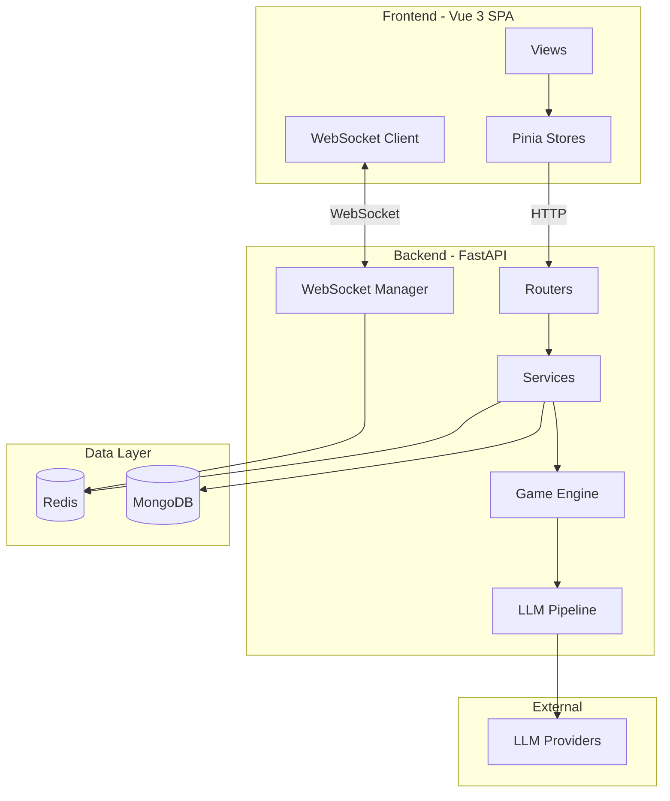

# Spy Among Us

[](https://github.com/chipfighter/SpyAmongUs/actions/workflows/ci.yml)


<p align="center"><a href="README_zh.md">中文文档</a></p>

This is my graduation project -- a real-time multiplayer web game based on the classic Chinese party game **"Who Is the Spy" (谁是卧底)**.

Players join a room, get secretly assigned words, try to figure out who the spy is through description and deduction, then vote to eliminate suspects. I also integrated LLM-powered AI players to fill empty slots and an in-room @AI chat assistant.

## What I Built

- **Room system** -- public / private rooms with invite codes, 3-8 players, customizable rounds and timers
- **Complete game flow** -- God role polling, word distribution, timed speaking, voting, last words, and result settlement
- **AI players** -- empty slots are automatically filled by LLM-driven bots that can speak, vote, and bluff
- **@AI chat** -- type `@AI` in the chat to get streaming LLM responses (works outside game rounds)
- **Secret spy chat** -- spies can vote to open a temporary private channel to coordinate each round
- **Real-time everything** -- WebSocket-based messaging with heartbeat and auto-reconnect
- **JWT auth** -- access token + refresh token, Redis session management
- **Admin panel** -- player management, mute/ban, user feedback review
- **Player profiles** -- game stats, per-role win rates

## Architecture



## Tech Stack

| Layer | Technology |
|-------|------------|
| Frontend | Vue 3, Vue Router 4, Pinia, Axios, Vite 5 |
| Backend | FastAPI, Uvicorn, Python 3.11 |
| Database | Redis (sessions, rooms, game state) + MongoDB (users, persistent data) |
| Auth | JWT (PyJWT), access + refresh tokens |
| Real-time | WebSocket (native, per-room channels) |
| AI / LLM | Multi-provider HTTP streaming (DeepSeek, Zhipu, etc.) |
| CI | GitHub Actions |

## Getting Started

**Prerequisites:** Python >= 3.10, Node.js >= 18, Redis, MongoDB

```bash
# 1. Clone
git clone https://github.com/chipfighter/SpyAmongUs.git
cd SpyAmongUs

# 2. Set up environment
cp .env.example .env
# Edit .env with your Redis, MongoDB, JWT_SECRET_KEY, etc.

# 3. Backend
cd backend
python -m venv venv
venv\Scripts\activate        # Windows
# source venv/bin/activate   # macOS / Linux
pip install -r requirements.txt
python main.py               # starts at http://localhost:8000

# 4. Frontend (new terminal)
cd frontend
npm install
npm run dev                  # opens at http://localhost:5173
```

## Project Structure

```
SpyAmongUs/
├── .github/workflows/ci.yml   # CI pipeline
├── .env.example                # env var template
├── CHANGELOG.md
├── docs/                       # design docs & game rules
│
├── backend/
│   ├── main.py                 # FastAPI entry point
│   ├── config.py               # config & game constants
│   ├── dependencies.py         # service wiring
│   ├── models/                 # Pydantic models (User, Room, Message)
│   ├── routers/                # API routes (auth, room, game, ws, admin...)
│   ├── services/               # business logic layer
│   ├── utils/                  # Redis/Mongo clients, WS manager, etc.
│   ├── llm/                    # LLM pipeline, API pool, prompts
│   └── tests/                  # pytest unit tests
│
└── frontend/
    ├── src/
    │   ├── views/              # LoginView, LobbyView, RoomView, AdminView...
    │   ├── components/         # Room/ and Lobby/ components
    │   ├── stores/             # Pinia stores (user, room, chat, websocket)
    │   ├── composables/        # useNotification, useGameEvents
    │   └── __tests__/          # Vitest unit tests
    └── ...
```

## Game Rules (Quick Version)

1. **Prep** -- host creates a room, sets player count / spy count / rounds / timer. Everyone readies up; AI fills empty seats.
2. **God selection** -- system asks each player if they want to be God (the observer who hands out words). If no one accepts, AI does it.
3. **Words** -- God assigns two similar words: one for civilians, one for spies. You only see your own word.
4. **Speak** -- each player describes their word in one sentence within the time limit.
5. **Vote** -- everyone votes to eliminate a suspect. Ties cause a re-speak + re-vote; second tie skips to next round.
6. **Last words** -- eliminated player gets a moment to speak freely.
7. **Spy chat** -- spies can vote to open a secret channel each round.
8. **Win** -- civilians win by finding all spies; spies win if they match or outnumber civilians, or survive to max rounds.

## Running Tests

```bash
# Backend
cd backend
pip install -r requirements-dev.txt
pytest tests/ -v

# Frontend
cd frontend
npm install
npm run test
```

## Docs

- [Game Rules (详细)](docs/游戏规则.md)
- [Data Storage & Feature Spec](docs/数据存储+功能说明.md)
- [Dev Todo Log](docs/todo.md)
- [Changelog](CHANGELOG.md)
