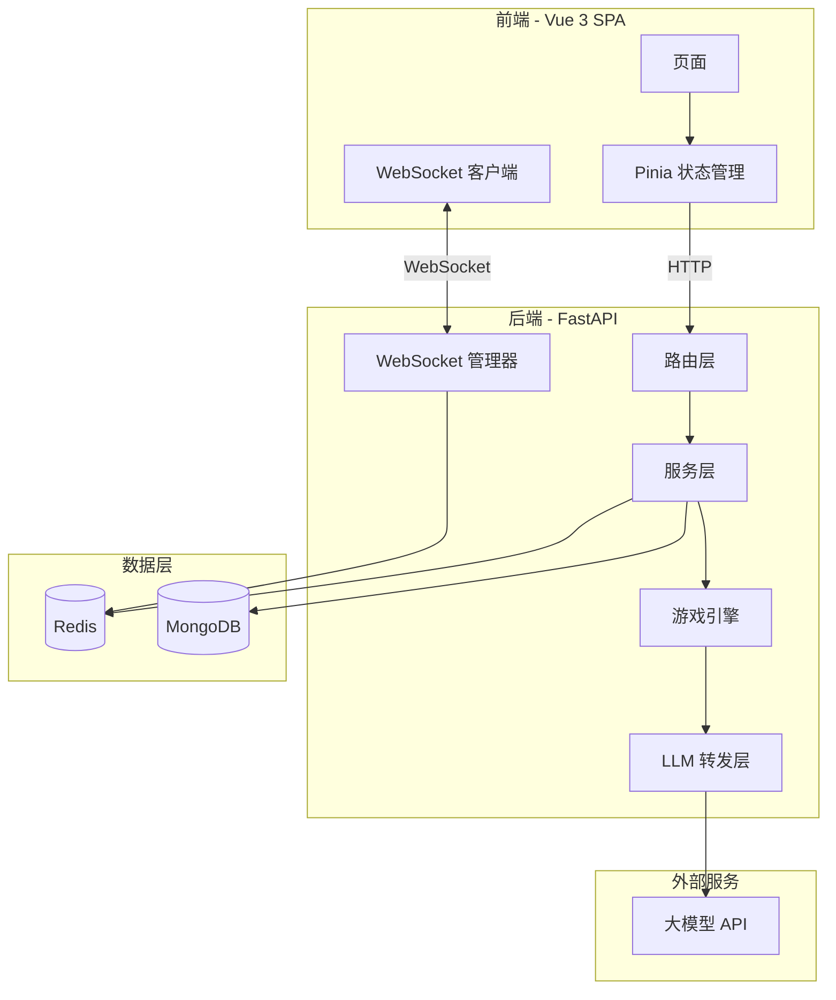

# 谁是卧底 (Spy Among Us)

[](https://github.com/chipfighter/SpyAmongUs/actions/workflows/ci.yml)


<p align="center"><a href="README.md">English</a></p>

这是我的毕业设计——一个基于经典桌游**"谁是卧底"**的实时多人网页游戏。

玩家加入房间后会被秘密分配词语，通过描述和推理找出谁是卧底，然后投票淘汰嫌疑人。我还接入了大模型驱动的 AI 玩家来自动补位，以及房间内 @AI 聊天助手。

## 做了什么

- **房间系统** -- 支持公开/私密房间（邀请码加入），3-8 人，自定义回合数和计时
- **完整游戏流程** -- 上帝轮询、词语分发、限时发言、投票、遗言、结算
- **AI 玩家** -- 空位自动由大模型驱动的 AI 补上，能发言、投票、伪装
- **@AI 聊天** -- 在聊天框里 @AI 就能获得流式大模型回复（游戏外可用）
- **卧底密聊** -- 卧底每轮可以投票开启临时私密频道互相沟通
- **全程实时** -- 基于 WebSocket，心跳检测 + 自动重连
- **JWT 鉴权** -- 访问令牌 + 刷新令牌，Redis 会话管理
- **管理后台** -- 管理玩家、禁言/封禁、处理用户反馈
- **玩家档案** -- 游戏数据统计、分角色胜率

## 架构



## 技术栈

| 层级 | 技术 |
|------|------|
| 前端 | Vue 3、Vue Router 4、Pinia、Axios、Vite 5 |
| 后端 | FastAPI、Uvicorn、Python 3.11 |
| 数据库 | Redis（会话、房间、游戏状态）+ MongoDB（用户、持久化数据） |
| 鉴权 | JWT（PyJWT），访问令牌 + 刷新令牌 |
| 实时通信 | WebSocket（原生，按房间分频道） |
| AI / LLM | 多供应商 HTTP 流式调用（DeepSeek、智谱等） |
| CI | GitHub Actions |

## 如何运行

**前提：** Python >= 3.10、Node.js >= 18、Redis、MongoDB

```bash
# 1. 克隆
git clone https://github.com/chipfighter/SpyAmongUs.git
cd SpyAmongUs

# 2. 配置环境变量
cp .env.example .env
# 编辑 .env，填上你的 Redis、MongoDB、JWT_SECRET_KEY 等

# 3. 启动后端
cd backend
python -m venv venv
venv\Scripts\activate        # Windows
# source venv/bin/activate   # macOS / Linux
pip install -r requirements.txt
python main.py               # 启动在 http://localhost:8000

# 4. 启动前端（新开终端）
cd frontend
npm install
npm run dev                  # 打开 http://localhost:5173
```

## 项目结构

```
SpyAmongUs/
├── .github/workflows/ci.yml   # CI 流水线
├── .env.example                # 环境变量模板
├── CHANGELOG.md
├── docs/                       # 设计文档和游戏规则
│
├── backend/
│   ├── main.py                 # FastAPI 入口
│   ├── config.py               # 配置和游戏常量
│   ├── dependencies.py         # 服务注入
│   ├── models/                 # Pydantic 模型（User、Room、Message）
│   ├── routers/                # API 路由（auth、room、game、ws、admin...）
│   ├── services/               # 业务逻辑层
│   ├── utils/                  # Redis/Mongo 客户端、WS 管理器等
│   ├── llm/                    # LLM 转发层、API 池、提示词管理
│   └── tests/                  # pytest 单元测试
│
└── frontend/
    ├── src/
    │   ├── views/              # 登录、大厅、房间、管理后台等页面
    │   ├── components/         # Room/ 和 Lobby/ 组件
    │   ├── stores/             # Pinia 状态管理（user、room、chat、websocket）
    │   ├── composables/        # useNotification、useGameEvents
    │   └── __tests__/          # Vitest 单元测试
    └── ...
```

## 游戏规则（简版）

1. **准备** -- 房主建房间，设置人数/卧底数/回合数/计时。大家准备好以后，空位由 AI 补上。
2. **选上帝** -- 系统轮流问每个玩家要不要当上帝（观战 + 发词语的角色）。都不愿意的话就 AI 来。
3. **发词语** -- 上帝给所有人分两个意思相近的词：平民一个词，卧底一个词。你只能看到自己的。
4. **发言** -- 每个人在限定时间内用一句话描述自己的词。
5. **投票** -- 所有人投票淘汰嫌疑人。平票的话补充发言后重新投；再平票就直接下一轮。
6. **遗言** -- 被淘汰的人可以自由说几句。
7. **密聊** -- 卧底每轮可以投票开临时私聊频道。
8. **胜负** -- 平民投出所有卧底就赢；卧底活到人数不少于平民，或者撑到最大回合数就赢。

## 跑测试

```bash
# 后端
cd backend
pip install -r requirements-dev.txt
pytest tests/ -v

# 前端
cd frontend
npm install
npm run test
```

## 文档

- [游戏规则（详细版）](docs/游戏规则.md)
- [数据存储 + 功能说明](docs/数据存储+功能说明.md)
- [开发 Todo 记录](docs/todo.md)
- [更新日志](CHANGELOG.md)
