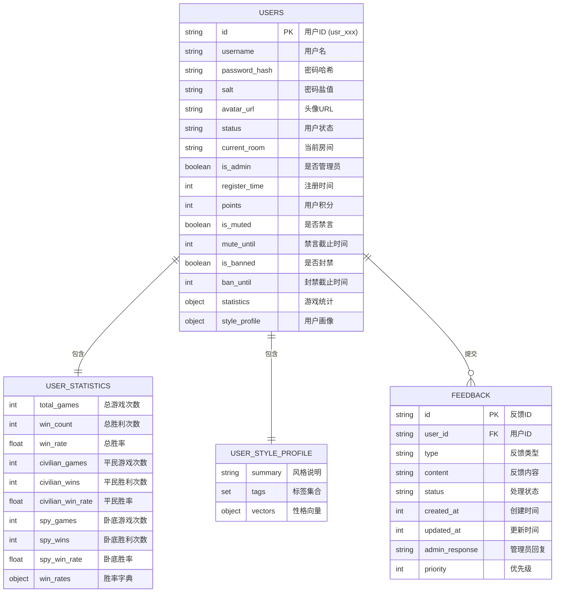

### v0.0.12

- 暂时不知道（简单检查优化一下就是MVP了）

### v0.0.11

- 秘密聊天室

### v0.0.10

- 游戏结算+用户评定

### v0.0.9

- 游戏进行（投票相关）

### v0.0.8 

- 游戏初始化相关
- 修复了加入/离开房间存在的用户同步问题
- 修复了部分小bug

### v0.0.7

- 自由聊天
- 加入/退出房间

### v0.0.6

- 调整AI功能并加入正常聊天

### v0.0.5

- 房主聊天
- 创建房间
- 删除房间
- 调整了前后端用户检测的功能

### v0.0.4

- 完全调整了数据存储和交互方式
- 重新调整部分功能
  - 注册
  - 登陆

### v0.0.3

- 房间聊天调整
  - 创建房间后可以正常查看用户列表
- 加入部分浏览器调试信息（之后stable版本删除）
- 调整用户注册信息记录（MongoDB中信息调整）

### v0.0.2

- 创建房间
- 正常聊天

### v0.0.1

- 登陆功能
- 注册功能
- 大厅界面

