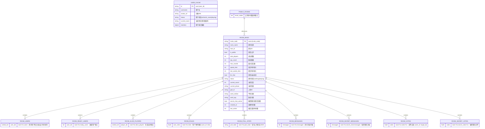
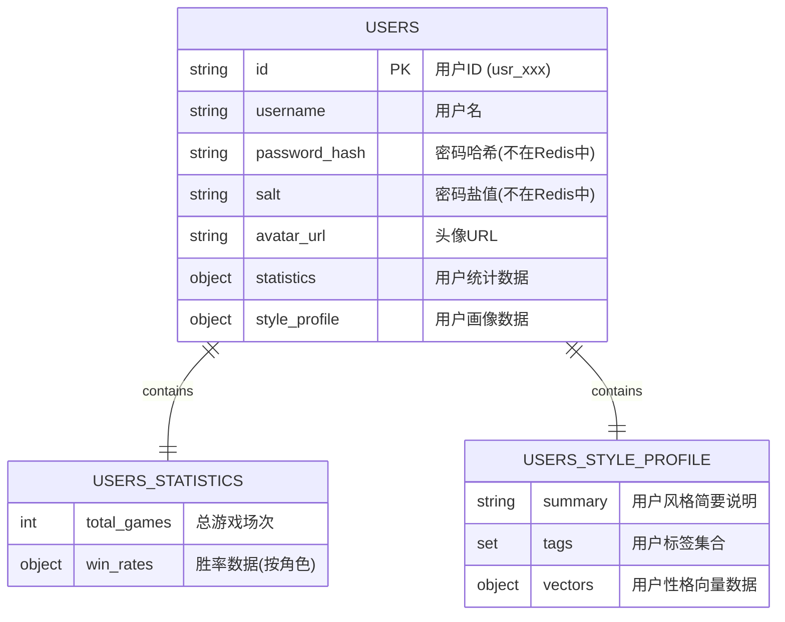
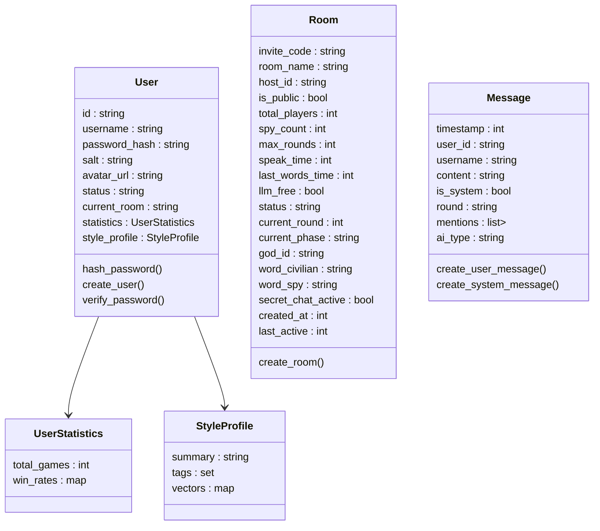

## 存储说明

默认未标注全部使用`String`类型存储（redis中扁平化存储），标注的会不一样，仅仅给人看的清晰嵌套样式

#### 用户信息

- MongoDB：

  ```
  "user": {
      "id": "user_id",
      "username": "example_user",
      "password_hash": "hashed_password_value",
      "salt": "random_salt_value",
      "avatar_url": "https://example.com/avatar.jpg"	// null则为默认头像（暂时不提供默认头像选择）
      "statistics" :{
  		"total_games": 3,	// 总局数
  		"win_rates": {		// 细分胜率统计
  			"civilian": 0.67,
  			"spy": 0.33
  		}
  	}
  	"style_profile": { 		// 结构化画像数据（当前评分完全交由llm来评定）
  		"summary": "擅长伪装...",	// 简要用户画像描述（60字以内）
          "tags(Set)": ["模糊词义", ""]	// 简要画像tags
          "vectors":{		// 暂时不使用，之后可以配合 统计描述+llm描述加权 评分，同时确定自定义画像种类}
    	}
    
  }
  ```

- Redis：

  ```
  user:{user_id} -> hash{
  	status: "online/in_room/playing",
		current_room: by_code,		// 用户当前房间（仅redis中保存）
      username: "example_user",
      avatar_url: "https://example.com/avatar.jpg",
      total_games: 3,		// 总局数
      win_rate_civilian: 0.67,
      win_rate_spy: 0.33
      summary: "擅长伪装...",		// 简要用户画像描述（60字以内）
      tags -> Set: ["模糊词义", ""]		// 简要画像tags
  }

#### 房间信息

- Redis

```
# 房间基本信息（使用Hash存储）
room:{invite_code} -> hash{
    created_at: "1712574000000",    # 创建时间（Unix时间戳）
    last_active: "1712574000000",   # 最后活动时间（Unix时间戳） 
    room_name: "房间名",
    host_id: "房主ID",
    is_public: "true",              # 字符串形式的布尔值
    total_players: "6",             # 总玩家数
    spy_count: "2",                 # 卧底数量
    max_rounds: "3",                # 最大回合数
    speak_time: "60",               # 发言时间
    last_words_time: "30",          # 遗言时间
    llm_free: "false",              # 是否允许大模型自由聊天
    status: "waiting",              # 房间状态：waiting/playing
    current_round: "0",             # 当前回合
    current_phase: "speaking",      # 当前阶段（speaking/voting/secret_chat/last_words）
    god_id: "user_id",              # 上帝ID（null表示使用AI）
    secret_chat_active: "false"     # 秘密聊天是否激活
    word_civilian: "平民词",
    word_spy: "卧底词"
}

# 房间用户集合（使用zSet存储）
room:{invite_code}:users -> zset[user_id1, user_id2, ...]

# 准备用户集合（使用Set存储）
room:{invite_code}:ready_users -> set[user_id1, user_id2, ...]

# 存活玩家集合（使用Set存储）
room:{invite_code}:alive_players -> zset[user_id1, user_id2, ...]

# 轮询上帝状态 (使用 String 存储 JSON)
poll_state:{invite_code} -> string (JSON) {
    "player_list": ["usr_b", "usr_a", ...],  # 随机打乱后的玩家ID列表
    "current_index": 0,                     # 当前正在询问的玩家在player_list中的索引
    "trace_id": "poll_xyz_timestamp",       # 用于日志追踪的唯一ID
}

# 角色分配（使用Hash存储）
room:{invite_code}:roles -> hash{
    user_id1: "civilian",
    user_id2: "spy",
}

# 房间消息（使用List存储）
room:{invite_code}:messages -> list[
]

# 投票记录（每轮一个Hash）
room:{invite_code}:votes:{round} -> hash{
    user_id1: "target_id",
    user_id1_time: "2.3",
    user_id2: "target_id",
    user_id2_time: "1.5"
}

# 秘密聊天投票（使用Hash存储）
room:{invite_code}:secret_votes:{round} -> hash{
spy_id1: "true",
spy_id2: "false"
}

# 秘密聊天消息（使用List存储）
room:{invite_code}:secret_chat:messages -> list[
]
```

#### 公共房间

- Redis

```
public_rooms	// 公共房间的ID，以供快速查找
```

#### 消息封装（仅对象）

```
"message": {
    "timestamp": 1712574000000,  // *唯一标识，发送时间（统一使用Unix时间戳）
    "user_id": "user_id_123",            // 发送者ID
	“username”: "发送者用户名",		// 主要为了发送给llm可以直接快速，avatar_url缓存于前端
    "content": "这是一条消息内容",        // 消息内容
    "is_system": false,                  // 是否为系统消息，true 表示系统消息，false 表示用户消息
    "round": "round_1"                   // 所属回合（字符串类型）
    
    "mentions": ["id"：{user_name}]
    "ai_type"	// 当前并不支持
}
```

## 功能流程+数据变化记录

#### 创建房间


#### 加入房间


#### LLM相关的实现（含流式结构）


大概的流程：

>先解析前端的@操作；判断当前的游戏情况（游戏中的时候是secret_channel/普通聊天室的调用）
>获取API+provider
>将API+provider交给http_client
>得到回来的流式消息
>封装调整再直接转发给前端【需要websocket在当前房间内所有连接广播回去】
>如果发送完毕确认了，需要给前端发送对应消息格式来确认，同时本地需要整合消息转化成message.py的格式来保存

##### 不同情况下的prompts设计

###### @的情况（暂不支持LLM区分情况）

a) message_service接收消息的时候判断是否有@人的操作，然后查看是否存在LLM（现在不对不同的llm厂商做区分），@ai助理，那就获取当前的redis中该房间的消息（最近50条）然后调用llm_pipeline的处理（@真人用户之后处理）
b) llm_pipeline拿到历史记录以后就是判断当前的情况（之后游戏是轮换着来的，所以调用是game_service中实现的），当前是@的情况，那就告诉prompts_manager当前什么情况，然后取得对应场景的prompt组合，下面配上历史记录（str类型），将数据预处理成llm需要的格式。
c) 然后调用api_pool取得对应的api，然后再调用http_client来发送消息
d) 默认得到的是流式返回，我准备将原格式的流式消息直接传输回message_service，然后message_service内部进行两步处理：转化成前端需要的

## 额外模块机制

### 用户信息监测机制+连接检测机制

##### 需求：

- 鉴权

- 避免假死

- 调回状态（暂无实现）


##### 实现思路：

- JWT前端鉴权（每次API调用都用来鉴权，直接设定25min的refresh_limit，如果前端断线这么久默认返回401），Refresh Token存储在前端HttpOnly Cookie中
- redis维护TTL来监测每一个用户redis实例，如果API调用那么直接修改用户id对应的redis-TTL


- websocket和后端JWT+session监测不冲突，针对长连接的短期清理

##### 后端实现

* 大部分API调用自动JWT检查+对应user_id的session刷新
* 如果JWT鉴权失败就自动根据user_id清理掉对应的redis用户session

- 向前端提供一个检查session是否存在的API调用

##### 前端实现

- 前端直接心跳机制检测，每30s一次ping-pong操作，如果后端10s内不反应自动尝试重连，3次重连失败自动弹窗报错。

### 断线重连机制

- 每次刷新界面（而非跳转界面），自动调用后端session检查，如果不存在，自动清理用户前端缓存然后跳转登陆界面
- JWT鉴权失败，自动清理缓存并跳转登陆界面


## 代码中的mermaid说明

### Redis

##### 房间相关存储



### MongoDB



### Models存储



